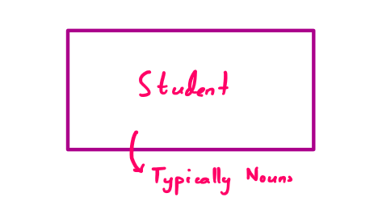
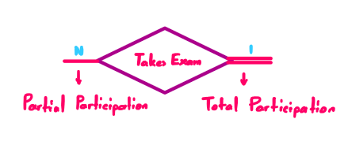
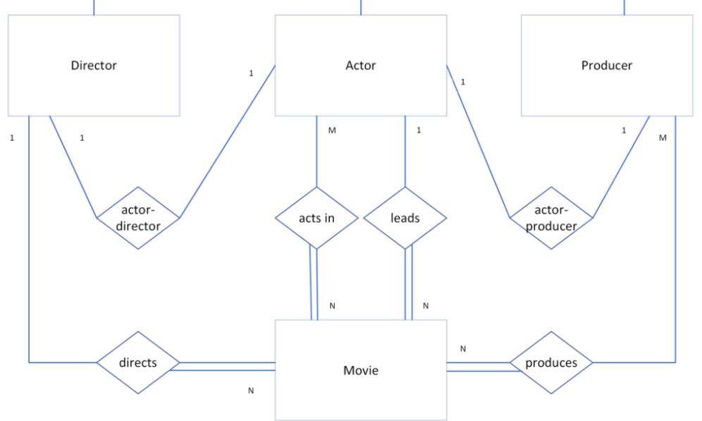

Entity Relationship Diagrams
============================

.. raw:: html

   

Entity Relationship Diagrams are graphical representations of the entities and their relationships in a database. They are used to provide flexible data-structuring and present a logical structure of the entire database. Hence, they are considered **conceptual models**. In this section, we will discuss the components of an ERD and how they are represented.

They consist of three main units:

* `Entity Sets <#entity-sets>`_
* `Relationship Sets <#relationship-sets>`_
* `Attributes <#attributes>`_

Entity Sets
-----------

.. raw:: html

   

Represented by rectangles. Each entity set is a collection of similar entities.

**Note:** Entities are typically nouns.

**Examples:** Student, Course, Department, etc.

|

Relationship Sets
-----------------

.. raw:: html

   

Represented by diamonds. Each relationship set is a collection of similar relationships.

**Note:** Typically verbs

**Examples:** IsEnrolled, TakesExam, Publishes etc.

Relationship Sets have Cardinality constraints:

* One-to-One
   * **Example:** "each person has exactly one NHS number"
* Many-to-One
   * **Example:** "a studio may produce multiple films"
* Many-to-Many
   * **Example:** "an actor may star in many films and a film may have many actors"

They also have Participation constraints:

* Total participation
   * "each student must be enrolled in at least one course" 
* Partial participation
   * "a customer does not need to take a loan to be registered with a bank"

Attributes
----------

.. raw:: html

   

Represented by ellipses. Each attribute is a property of an entity or a relationship set.

**Note:** Attributes are typically adjectives.

|

**Note:** Underlined attributes are primary keys.

|

|

**Note:** Attributes can be hold multiple values.

|

 
|

**Note:** Attributes can be computed from other attributes, these are not stored as they may change on subsequent fetches.

|

Worked Example
--------------

.. raw:: html

   

This section will provide a walkthrough of how to build an ERD when given a suitable scenario. 

**Question:**

Construct an ER diagram for a database that stores information about movies, actors, directors, and
producers. Many actors can take part in a movie and an actor can be involved in many movies. A movie
has to have only one leading actor. A movie can only be directed by one director, but it can be produced
by many producers. Moreover, a movie cannot exist in the system without actors, producers and a
director. A director can be an actor and vice versa. Similarly, an actor can be a producer and vice versa.

.. note:: 
    For this example, we will not specify attributes.

**Step 1: Identify the entities**

The question states that there the database stores information about **movies**, **actors**, **directors** and **producers**. Hence, we have the following four entities:

* ``movies``
* ``actors``
* ``directors``
* ``producers``

**Step 2: Identify the relationships**

The question states that movies require actors to act in them, a leading actor, a director to direct them and producers to produce them. Hence, we arrive at the following relationships:

* ``acts in``
* ``leads``
* ``directs``
* ``produces``

**Step 3: Identify the cardinality and participation constraints**

The statement that "**many actors** can take part in **a movie** and **an actor** can be involved in **many movies**" implies that we have a many-to-many relationship between **actors** and **movies**.

Next, the statement "A movie has to have only one leading actor" suggests that there is a one-to-many relationship between **actors** and **movies**. Since a movie can only have one lead but an actor can lead in many movies.

Similarly, the statement "A movie can only be directed by one director" implies the same one-to-many relationship between **directors** and **movies**.

Finally, the statement "a movie can be produced by many producers" suggests a many-to-many relationship between **producers** and **movies**.

* ``acts in`` [actors/movies] (many-to-many)
* ``leads`` [actors/movies] (one-to-many)
* ``directs`` [directors/movies] (one-to-many)
* ``produces`` [producers/movies] (many-to-many)

**Step 4: Construct the ERD**

Based on the previous three steps, we now have the necessary information to construct the ERD. Using rectangles for entities, diamonds for relationships and ellipses for attributes, we can represent the ERD as follows:

