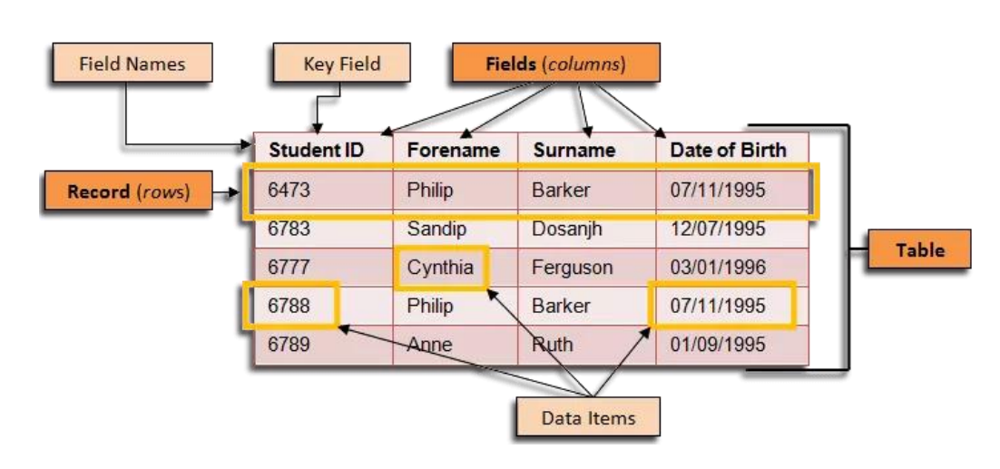

Relational Models
=================

.. raw:: html

   

The Relational Model is an internal model to represent the data visualised in the ERD. The Relational Model represents data in the form of tables. Each table is a relation. Each row in a table represents a relationship among a set of values. Each column in a table represents an attribute of the relation. In this way, they are much cloesr to the physical representation of the data. Like how a library might organise books on shelves.

In the above example, note the following:
* Unique column names
* Unique row entries
* Unique Primary Keys (i.e. StuentID)

Relational Schema
-----------------

.. raw:: html

   

The way that we represent the relational model is through a relational schema. This is a collection of relation schemas. Each schema is a table with a name and a set of attributes. The attributes are the columns in the table. The name of the relation is the name of the table. 

To convert the above table into a relational schema, we would have the following:

.. raw:: html

   

   

     Students(
     Student ID
       Unique Student ID numbers
     , 
     Forename
       Student Forename
     , 
     Surname
       Student Surname
     , 
     Date of Birth
       Student Date of Birth
     )
   

.. note:: 
    The underlined attribute represents the primary key. It is unique for each entry in the table, meaning that there cannot be two students with the same Student ID. This is crucial to the relational model as it allows us to uniquely identify each row in the table.

Since the Relational Model is a formalization of the Entity Relationship Diagram, the cardinality contraints can be represented in the Relational Schema as well.

* One-to-Many
   * The Primary Key of one relation is migrated into the other relation as a Foreign Key.
      * **Example:** "*One* user can have *many* tweets"

        .. raw:: html
            

           <b>Users</b>(<u>uid</u>, username) 
           <b>Tweets</b>(<u>tid</u>, content, date, uid)

* Many-to-Many
   * Primary Keys of both relations are mapped into a new table, where both keys are used to form a composite primary key.
      * **Example:** "*A* tweet can have *many* hashtags." and "*A* hashtag can be used in *many* tweets."
         
        .. raw:: html

            

            <b>Tweets</b>(<u>tid</u>, content, date, uid) 
            <b>Hashtags</b>(<u>tag</u>) 
            <b>Uses</b>(<u>tid</u>, <u>tag</u>)

RDBMS
-----

.. raw:: html

   

Databases are structured collections of data. To manage and access data, a Database Management System is used. In the case of the relational databases we have been discussing, the system is called a Relational Database Management System (RDBMS). These systems allow users to do the following:

* Define the schema of the database (DDL)
* Query the database for information (DQL)
* Modify data in the database (DML)

.. note::
    Querying of data in the database is done using High Level Query Languages like ``SQL`` (Structured Query Language).
    Other Examples include: ``Oracle``, ``MySQL``, ``PostgreSQL``, ``SQLite``, etc.

.. tip:: 
    Why RDBMS?

    * Guaranteed protection against loss of data
    * Efficient access
    * Associated high-level language for defining, manipulating and querying data
    * Concurrent access is allowed

ACID
----

.. raw:: html

   

All RDBMS systems are designed to ensure that the data in the database is consistent and reliable. To ensure this, they follow the ACID properties:

* **Atomicity:** All operations in a transaction are completed successfully or none are completed.
* **Consistency:** Transactions bring the database from one valid state to another.
* **Isolation:** Concurrent/Sequential transactions leave the database in the same state.
* **Durability:** Commits are permanent and survive system failures.

cd ..
sphinx-build -b html source build
cd build
start index.html